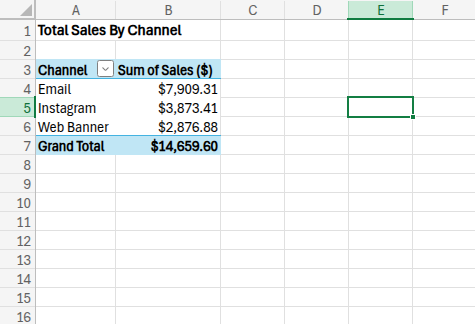
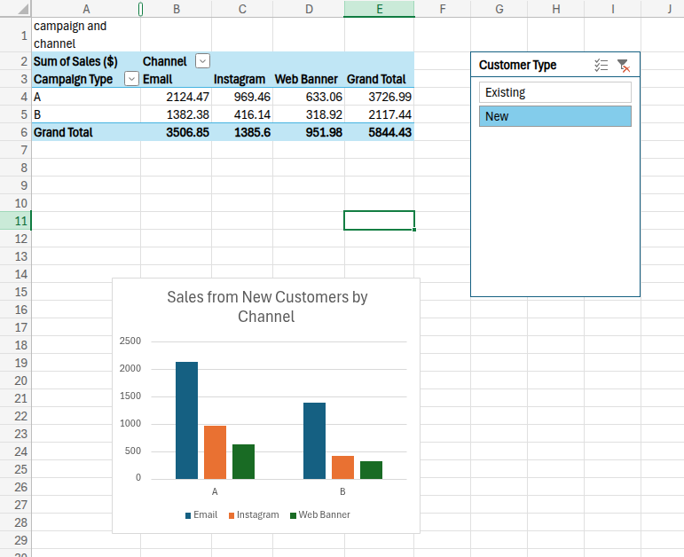
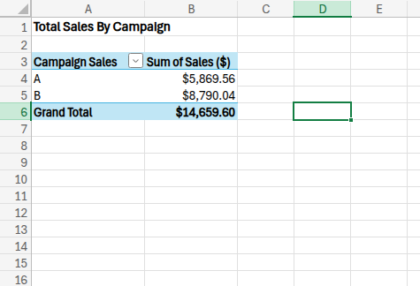

## Campaign Revenue Analysis - Excel

Sales channel and campaign analysis using Excel pivot tables and charts

## Overview
This project involved analysing sales data across two marketing campaigns to determine which generated the most revenue and which channel was most effective at converting new customers

## The Business Question
A business ran two campaigns with different messaging approaches:
- **Campaign A** – informal, conversational tone
- **Campaign B** – sales-focused, promotional tone

The goal was to identify which campaign and which channel performed best, 
particularly for acquiring new customers.

## Tools Used
Microsoft Excel (Pivot Tables, Charts)

## Key Findings
- **Email** was the highest revenue-generating channel across both campaigns.

- **Campaign A** outperformed Campaign B for new customer revenue — suggesting
that a conversational tone resonates more with new audiences than a direct 
promotional approach.

## Business Recommendation

Businesses targeting customer acquisition may benefit from prioritising conversational and relationship-focused messaging strategies over heavily promotional campaigns, particularly in email marketing.

- This highlights that for businesses targeting new customers, tone of messaging 
can be just as important as the offer itself.

 
